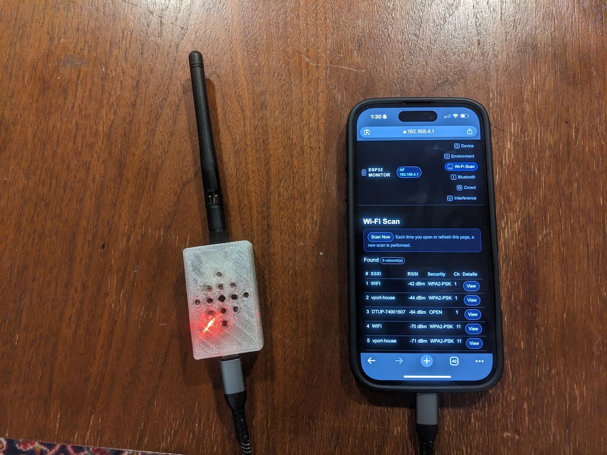

# ESP32 Wi-Fi & Bluetooth Scanner App



A comprehensive ESP32-based wireless monitoring tool that creates a standalone access point with a web interface for scanning and analyzing Wi-Fi networks, Bluetooth Low Energy (BLE) devices, RF interference, and crowd density.

## Features

### 📡 **Device Monitoring**
- Real-time ESP32 chip information (model, revision, cores, CPU frequency)
- Flash memory details and speeds
- Heap and PSRAM usage tracking
- System uptime and reset reason
- Serial connection detection

### 🌡️ **Environment Monitoring**
- On-chip temperature sensor with historical graphing
- Min/max temperature tracking since boot
- Hall effect sensor readings
- Access Point status and connected stations
- Visual temperature trends over time

### 📶 **Wi-Fi Scanner**
- Scan and list all nearby Wi-Fi networks
- Detailed AP information (SSID, BSSID, RSSI, channel, security)
- Router vendor detection heuristics based on SSID and MAC OUI
- Channel congestion analysis
- Per-network signal strength and encryption type

### 🔵 **Bluetooth Low Energy Scanner**
- Detect nearby BLE devices
- Device classification based on name patterns (phones, wearables, earbuds, smart home)
- Distance estimation using RSSI and TX power
- Manufacturer data extraction
- Device tracking and presence detection

### 👥 **Crowd Density Analysis**
- Heuristic crowd detection combining Wi-Fi and BLE counts
- Real-time activity level assessment
- Useful for presence detection and occupancy monitoring

### 📻 **RF Interference Monitoring**
- 2.4 GHz band congestion analysis
- Per-channel interference visualization
- RF energy scoring based on signal strengths
- Helps identify optimal channels and sources of interference

## Hardware Requirements

- **ESP32 Development Board** (any ESP32 variant)
- **USB Cable** for programming and power
- **Computer** with PlatformIO installed

## Software Requirements

- [PlatformIO](https://platformio.org/) (VS Code extension or CLI)
- Arduino framework for ESP32

## Installation

1. **Clone or download this repository**
   ```bash
   git clone <your-repo-url>
   cd webserver
   ```

2. **Open in PlatformIO**
   - Open the project folder in VS Code with PlatformIO extension installed
   - Or use PlatformIO CLI

3. **Configure Upload Port** (optional)
   - Edit `platformio.ini` and change `upload_port` to match your COM port
   ```ini
   upload_port = COM8  ; Change to your port
   ```

4. **Build and Upload**
   ```bash
   pio run --target upload
   ```

5. **Monitor Serial Output**
   ```bash
   pio device monitor
   ```

## Usage

1. **Power on the ESP32**
   - The device creates a Wi-Fi access point named `ESP32-Monitor`
   - Default password: `12345678`

2. **Connect to the Access Point**
   - Connect your phone, tablet, or computer to `ESP32-Monitor`
   - Password: `12345678`

3. **Access the Web Interface**
   - Open a web browser and navigate to: `http://192.168.4.1`
   - You'll be redirected to the Device page automatically

4. **Navigate the Interface**
   - **Device**: View ESP32 hardware specifications and system status
   - **Environment**: Monitor temperature, hall sensor, and AP statistics
   - **Wi-Fi Scan**: Scan and analyze nearby Wi-Fi networks
   - **Bluetooth**: Discover and examine BLE devices
   - **Crowd**: Assess wireless activity and crowd density
   - **Interference**: Analyze 2.4 GHz RF noise and channel congestion

## Web Interface Pages

| Page | Description |
|------|-------------|
| `/device` | ESP32 hardware info, memory usage, uptime |
| `/environment` | Temperature graphs, hall sensor, AP stats |
| `/wifi` | Wi-Fi network scanner with detailed AP views |
| `/ble` | Bluetooth Low Energy device discovery |
| `/crowd` | Crowd density heuristics based on wireless activity |
| `/rf` | RF interference and channel congestion analysis |

## Configuration

### Access Point Settings
Edit in `src/main.cpp`:
```cpp
const char* apSSID = "ESP32-Monitor";  // Change AP name
const char* apPASS = "12345678";       // Change AP password
```

### Scan Parameters
Adjust BLE scan duration:
```cpp
int scanTimeSeconds = 3;  // Line ~486 in buildBlePage()
```

## Technical Details

- **Access Point IP**: `192.168.4.1`
- **Web Server Port**: `80`
- **Serial Baud Rate**: `115200`
- **BLE Scan**: Active scanning with 100ms interval, 80ms window
- **Wi-Fi Mode**: Dual AP+STA for simultaneous AP hosting and scanning

## Use Cases

- **Network surveying** and site analysis
- **IoT device discovery** in smart homes
- **Wireless troubleshooting** and optimization
- **Privacy awareness** (see what devices are broadcasting)
- **RF environment assessment** for wireless deployments
- **Presence detection** and occupancy monitoring
- **Educational tool** for learning about wireless protocols

## Privacy & Ethics

This tool passively monitors wireless signals that are publicly broadcast. It does not:
- Decrypt or intercept any data
- Connect to networks without authorization
- Track individuals or devices over time (by default)
- Store any sensitive information

Use responsibly and in accordance with local laws and regulations.

## License

MIT License - See [LICENSE](LICENSE) file for details

## Contributing

Contributions are welcome! Please feel free to submit pull requests or open issues for bugs and feature requests.

## Acknowledgments

- Built with [Arduino framework](https://github.com/espressif/arduino-esp32)
- Uses ESP32 BLE and Wi-Fi libraries from Espressif
- Developed with [PlatformIO](https://platformio.org/)

---

**Project Status**: Active Development  
**Last Updated**: December 2025
